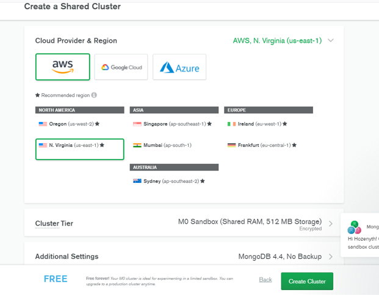
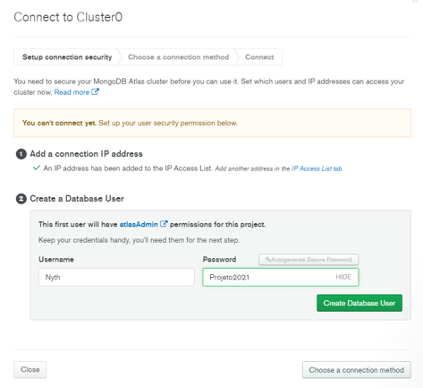

<h1>Api usando banco de dados em nuvem MongoDB Atlas</h1>
 
 Esse projeto foi feito através do Visual Studio .NET 5.0. Referência do projeto: <a href="https://github.com/gabrielfbarros/dotnet-mongo"> 
      Curso Dgital Innovation One
 </a>
 O mongoDB é um banco de dados não relacional (NoSQL) ele é utilizado pra registro de documento e as tabelas são chamadas de coleção e a coluna de atributos.
 
 <h2>PASSO A PASSO DO CADASTRO AO MONGODB ATLAS.</h2>
 
  •	Criar um cluster. No caso foi criado um banco na opção gratuito.
   
  
  •	Criar um usuário em Network Acess com nome e senha ler e escrever no banco.
  
  
  •	Adicionar um IP no caso foi usado permitir acesso de qualquer lugar.
  • Ir em Clusters e conectar ao cluster criado. Escolher um método de conexão e selecionar o driver C# NET e a versão. Copiar o link de acesso. OBS.: No programa no arquivo
  appsettings.json o link de acesso deve ser substituido  com o password e o MyFirstDatabase.
  
 
